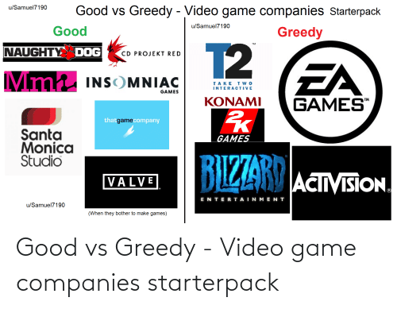
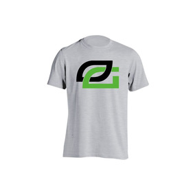

PROYECTO  PRACTICA 2 - RESOLUCION DE PROBLEMAS CSS 
1.	Diseño del Index

A.	HTML (index) y CSS (css-index)
<meta charset="UTF-8">
<title>MenuPlantilla</title>
<link rel="stylesheet" href="CSS/CSS-Index.css" type="text/css"/>

•	Como primer punto vemos el idioma y el titulo del proyecto
•	En el código de link real = styleshet muestra un estilo ideal como para pantallas mobiles
•	El href pues por medio de este nos dirigimos a nuestra dirección del archivo css
•	Type text/css es un estilo de de escritura que permite alinear el texto en diversas posiciones, como son los cuadros de textos

<body>
    

        
    

    

        

            <i class="fa fa-search"></i>
            <input type="search" id="search" placeholder="Search..." />
        

    

        

            <ul class="sociales">
                <li>
                    
                    
                </li>

                <li>
                    
                    
                </li>
            </ul>
        

•	Colocamos las foto de acuerdo al diagrama y lo hacemos dentro de un div; ya que este permite dividir por secciones o zonas de esta manera se agrupa elementos y aplicar estilos. 
•	Class o id: esto nos permite seccionar el documento en partes diferentes, por ejemplo, seccionar el documento por partes y trabajar mediante cuadros, diagramas, etc. Es decir, podemos trabajar por secciones determinadas y se puede crear una dentro de otra las veces que necesitemos y poderlas modificar a nuestro antojo mediante las CSS.
•	Span  es un tipo de escritura por lo general la utilizamos para generar cuadros de texto. Como vemos en el ejemplo esta vez la utilizamos para un buscador en nuestra pantalla. Como vemos esta dentro de el <i> es un estilo de escritura.
•	Input: pues permite ingresar datos y al colocar el type=search nos permite crear un estilo buscador. Id pues permite ser usado como un identificador único donde no se puede repetir y complementado con el placeholder ya podemos colocare en nuestra barra el mensaje de buscar.

•	Para las redes sociales pue mandamos una imagen el la cual con el width, height le damos una dimensión 
•	con la ayuda del href ingresamos a la dirección web anteponiendo el https:// y la dirección a la que deseemos ingresar. En este caso creamos dos fotos con sus respectivas direcciones; Facebook y email.
•	
•	CSS
body{
    background: #343d46;
}

.foto1 img{ padding: 5px; margin: 10px; border: 2px solid black; float: left; width: 250px; }

.sociales{
    float: right;
}
.sociales li{
    display: inline-block;
}
.sociales a{
    padding: 5px;
}

.box{
    display: inline-block;
}

.container-1 input#search{
    width: 800px;
    height: 40px;
    background: #ebecf0;
    border: none;
    font-size: 10pt;
    float: none;
    color: #63717f;
    padding-left: 15px;
    -webkit-border-radius: 5px;
    -moz-border-radius: 5px;
    border-radius: 5px;
}

•	En Body le agregamos nuestro color a toda nuestra pagina mediante nuestro código bachground y le mandamos el color mediante código.
•	En nuestra foto anterior y esta actual vemos como se pueden comunicar el html con el css, a as de la conexión que se realizo con el href. Pues aquí lo conectamos por celdas o secciones por medio class + el nombre que le mandamos; en este caso es foto1, y como en nuestro div tenemos la clase creada pues aquí podemos seleccionar la sección que deseamos trabajar y lo hacemos colocando después de nuestra clase; en esta caso img para trabajar directamente esa imagen.

•	Pandding, pue este nos permite tomar el valor de anchura, incluso se puede tomar varios valores en este caso obtenemos uno solo.
•	Margin: le damos un margen de tamaño px
•	border: le damos un borde de tipo solid blabk 
•	float: podemos dar ubicación a nuestra sección seleccionada.
•	Width: le damos dimensión de manera horizontal  nuestro texto, cajón, imagen, etc. seleccionada en el código

•	REDES SOCIALES: para las redes sociales le mandamos un li ya que se encutra colado dentro del <li></li>
Y con la ayuda del inline-block pues ya nos permite visualizar nuestras redes sociales sin los puntos que nos genera este () . Float: right vemos como esta colocado a lado derecho de nuestro encabezado y todo esto lo llamamos mediante la clase Social.

•	por medio del container-1 input#search vamos a configurar nuestro buscador como ya vimos los comando de ubicación como son el widht y el heght; con el background le damos un color, en este caso no le damos un borde.
•	Por medio de Font-size nos dice el tamaño de la letra que se mostrara mediante el termino pt y a mas del color de la letra mediante el color y su color y finalmente el borde y a este le manejamos por dos secciones uno exterior y otro interno, el interno lo manejamos mediante el webkit-border-radius el cual le damos un borde de tamaño. Y el border-radious de manera externa. Es decir veremos nuestro ”cuadro” de manera redondeada. 

•	En la practica nos pide una barra de navegación
Esta la creamos en el mismo index ahora hablemos del código.

<nav>
    <ul class="navegador">
        <li><a href=paginas/pc.html>PC</a></li>
        <li><a href=paginas/consolas.html>Consolas</a></li>
        <li><a href=paginas/videojuegos.html>VideoJuegos</a></li>
        <li><a href=paginas/tienda.html>Tienda</a></li>
        <li><a href=paginas/contacto.html>Registro</a></li>
        <li><a href=paginas/trucos.html>Trucos</a></li>
        <li><a href=paginas/noticias.html>Noticias</a></li>
    </ul>
</nav>

•	Nav: pues es para hacer una navegación de pagina a pagina. En este caso vemos que tenemos una clase navegador dentro del <ul>  & <il> pues permite tener una lista de navegación de manera “ordenada” en donde sabemos a donde navegar por medio de la href asignada.

•	Veremos ahora el CSS
ul.navegador{
    margin:10px;
    padding:130px ;
}

ul.navegador li{
    display:inline-block;
    padding:0 20px;
    background-color: #fffbeb;
    padding: 5px 30px;
    -webkit-border-radius: 5px;
    -moz-border-radius: 5px;
    border-radius: 2px;
}

ul.navegador a:hover{
    background-color: #ebecf0;
    color: #AA5500;
}

•	Ul.navegador: vemos en el inicio la margen que le damos y el padding del tamaño 
•	en la segundo “paquete de código” referente al barra de navegación tenemos al display: inline-block que permite quitar esos puntos de orden; como los que tenemos en este documento. Y le damos pandding  de dos espacios. Background-color le damos un color; y finalmente otro pandding para la dimensión de nuestro border radious.  
•	A.hover: a entramaos precisamente al href y con hover le seleccionamos un color al momento de que visitemos esa pagina.

•	Continuamos con el código: ahora vamos con nuestro contenido, que en este caso seria el contenido de nuestra página.

    
    
 Bienvenidos a <b>GG VideoGames</b> donde tu eres el ganador

    <h4> Tenemos los mas bajos precios del mercado en consolas, pc, videojugos accesorios y mas. GGgames su unica tienda en el mundo.</h4>
    Registrate
    Login

•	En este código tenemos nuestra clase foto2 la imagen y un texto con código 
 & <h4>, de esta manera le damos dimensión a nuestro texto 
Span pues ya es para crear un cuadro de texto, claro que en este caso podría ser botones pero por ahora lo que se trata de estructurar el código pero ya se realizara en una página real. <b> nos permite resaltar con negrita las letras seleccionadas.

•	Código CSS
.foto2 {
    padding: 0em;
    margin: 0em 0 2em 12em;
    width: 500px;
}
 .foto2 img {
     position: absolute;
     top:  250px;
     left: 800px;
 }

 div.foto2 p{
     font-size:x-large;
     color: #8A9FFF;
 }

 .derecha   { float: right;border: 1px solid #CCC; background-color: #E0E0E0;}
 .izquierda { float: left;border: 1px solid #CCC;background-color: #E0E0E0;}
 
•	Primeramente le damos un margen a nivel general por medio del foto2; en este caso pandding, lo clocamos solo para estructurar de mejor manera por medio de u espacios que lo generamos con la ayuda del margin 
•	Foto2 img vamos a estructurar la imagen que tenemos, y lo hacemos por el position absolute;(utilizada con el top) claro que en este caso no es muy recomendado ya que solo estamos teniendo para configurara un imagen, pero si ya tenemos varias utilizamos el position relative de manera horizontal. pero al fin acabo se puede utilizar las dos. 
•	Foto2 p entramos para agregar un tamaño de letra con X-large y colores que se puede colocar 
•	Finalmente vamos a colocar las letras generadas en unos span de esta manera generamos un recuadro con nuestro código css. Float indicamos la dirección que deseemos ya sea izquierda o derecha; utilizamos el border para dar un porder de tamaño tal, su color dento del cuadro.

•	Ahora seguimos con la siguiente sección dentro de nuestra misma pagina 

    
    
    
    
    
    
    

        Comprar
    

•	Nuestra clase en este caso es paginación por el cual nos conectaremos a nuestra CSS. Ahora los que nos pide el documento es una cadena de imágenes con un botón en la parde de abajo.
•	Con src ingresamos a nuestra carpeta y cargamos las imágenes según su terminación y no olvidemos de crear un nombre con alt, pues este servirá identificar la imagen en cargo de tener una mala conexión o cualquier otro problema
•	Vemos ahora que introducimos un div + una clase, para poder manejar desde el css; aunque no es tan necesario este caso ya que ahí termina esa sección; pero lo hioce para demostrar que se puede y no nos va a dar error.

•	Codigo CSS
div.paginacion {
    border: 1px solid #CCC;
    background-color: #D2D4FF;
    padding: 70px;
    margin-top: 5%;

}

div.paginacion1 samp{
    font-size:x-large;
    color: #8A9FFF;
}

div.paginacion img{
    position: relative;
    left: 50px;
    float: left;
    width: 200px;
    margin: 10px;
    border: 1px solid black;
}
•	Como ya vimos se parece el código parecido al anterior a si mismo le damos una dimecion globalmente e incluso un color y un margen-top que no da la dimensión de la parte de inicio.
•	De la misma forma se da infreso al samp y colocamos las imágenes. Lo esencial aquí es la position relative que nos va colocando de manera horizontal las imágenes y a parte tenemos un border.

•	Vamos con la penúltima sección de esta parte; en el cual consistía mediante una página; pagada para hacer un estilo de contactos;  https://mockflow.com/app/#Wireframe. Basándonos a ese código colocamos una parecida a nuestra imagen del proyecto vemos ahora el código.

    

        

            
        

        

            Un videojuego es un juego electrónico en el que una o más personas interactúan,
            por medio de un controlador, con un dispositivo que muestra imágenes de video.1
            Este dispositivo electrónico, conocido genéricamente como «plataforma», puede ser una computadora,
            una máquina arcade, una videoconsola o un dispositivo portátil, como por ejemplo un teléfono móvil.
            Los videojuegos son, año por año, una de las principales industrias del arte y el entretenimiento.

    

    

        

            
                Administración

        

        

            
                Gerente
        

        

            
                Contabilidad
        

    

•	En este caso utilizamos las mismas clases para poder crear secciones. La sección que tenemos en contenedores no importa si se repita esta variable, siempre y cuando el llamado se realice de otro html y otro css; 

En este caso es donde as emos creado clases de todo nuestro código ya ue este se creo con un estilo de cajones principales y otros secundarios. Por ejemplo, vemos que en el pot se encuentra dentro de este caso la imagen 

•	Ahora en otro div se encuentra nuestro campo texto, con clase txt
•	En el siguiente código tenemos el menú y dentro de este se encuentran otras clases como son el port1,port2 y port3  el cual; cada uno cuenta con una imagen y una tipo de letra span.

•	Código CSS
#contenedor { margin: 0 auto; width: 1500px;  border: 1px groove #993300;
    position: relative; height: 600px; }
#cabecera { height: 300px; background-color: #1A175C;; }
/*menu*/
#txt{ position: absolute; top: 950px; left: 500px; width: 500px; height: 200px;
     margin: 10px; padding: 1px ; }

#menu {  position: absolute; top: 1200px; left: 10px; width: 1500px; height: 340px;
    background-color:#596870 ;}

#pot1 {position: absolute; top: 30px; left: 100px;}
#pot1 span {margin: 0 auto; width: 120px;  border: 2px groove #0075ea;
    position: absolute; height: 20px; top: 220px;left: 40px;}

#pot2{position: absolute; top: 30px; left: 650px;}
#pot2 span {margin: 0 auto; width: 120px;  border: 2px groove #0075ea;
    position: absolute; height: 20px; top: 220px;left: 40px;}
#pot3{position: absolute; top: 30px; left: 1200px;}
#pot3 span {margin: 0 auto; width: 120px;  border: 2px groove #0075ea;
    position: absolute; height: 20px; top: 220px;left: 50px;}
•	Nuestro contenedor permetiria de manera general dar un margen de manera general para toda nuestra estructura. Los códigos ya se explicaron al inicio, razón por la cual explicare de manera un poco mas rápida. Vemos que el margen se crea de manera en cero y auto; ya que le daremos dimensión por medio de los; width, heigt y por supuesto le damos una dimensión relativa y colocamo
 broove que es un estilo de borde al cual se le manda un color

•	en el txt  tenemos una posición absoluta; como ya definimos que es ideal para manejar de arriba, hacia abajo. Y esto se logra gracias la TOP,  y posteriormente vamos colocando con la posición left y la dimensión con width y height,  por su puesto tienen el margen y un padding  que separa del border.

•	Menú  tiene a nuestro siguiente cuadro que se realizara como un estilo de subdimensión que abarca los port1,pot2 y port3. Primeramnete le damos una dimensión general en el menú con el mismo código ya visto anteriormente, y port? Modificamos las imágenes y con el port? Span este pues permite modificar al texto, que gracias al Mergin y border se convierte en un cuadro de texto y el Groove le da el color que deseemos

•	Finalmente veremos el código final de nuestro index (Hipervínculos)

    
    

    
    

    
    <footer>
        <address id="contacto">
            Nombre: William Chabla  
            Organizacion: Universidad Politecnica Salesiana  
            Correo: <a href="mailto:wchabla@est.ups.edu.ec"> wchabla@est.ups.edu.ec </a>  
            Telefono: <a href="tel:+593984389617"> 0984389617 </a> 
            &copy; Todos los derechos reservados
        </address>
    </footer>

•	Como vemos no hacemos nada del otro mundo que ya hemos estado haciendo durante las clases y colocando imágenes, tal como hicimos al inicio, en donde nos dirigimos a la pagina por medio del icono de la red social
Nuestras clases son redes2 para twitter y redes3 para Snapchat

•	Ahora vamos en el siguiente código nuestra pie de pagina y observamos que este va con un footer, el cual nos permite hacer nuestro pie de pagina y de igual manera lo madamos con una clase para poder colocar en una área específica, esta vez se estructuro por medio de id = contacto 
•	Algo mas que destacar en esta parte es el uso de Hipervínculos, el sual se uso para dirigirnos a nuestro correo y teléfono esto se lo realizo por medio de href.

	Código CSS
div.rede2 img{
    position: absolute;
    top:  1550px;
    left: 50px;

}

div.rede3 img{
    position: absolute;
    top:  1550px;
    left: 125px;

}

div.foto4 img{
    position: absolute;
    top:  1600px;
    left: 15px;
}

div.foto4 footer{
    position: absolute;
    top:  1820px;
    left: 15px;

}
	como ya se observe en el resto de códigos pues a este se le coloco sencillamente dimensiones red2 y red3  para redes sociales y foto4 img será para ubicar la imagen y por su puesto foto4 footer será para el posicionamiento del pie de pagina. Lo que destaca aquí en la posición hacia abajo top y la posición hacia el lado izquierdo con left 

•	Por ultimo tenemos dos cuadro de información 
	El primero 

    

        Quienes somos? 

        

            Acerca de nosotros
        

    

    

        Donde nos encuentra

        

            Ubicación
        

    

    

        AbautC

        

            help
        

    

	Es una cadena de texto que se va realizando con span  y una clase para poder ubicarlo una debajo de otra de esta manera de ubicara de manera correcta en nuestro cuadro de comentario 

    

        Azuay

        

            Cuenca - Avenida Las Américas
        

    

    

        Cañar

        

            Azogues - Av. 24 de Mayo
        

    

    

        Morona Santiago

        

            Macas - Calle Simon Bolivar
        

    

	De la misma manera se ve nuestros datos de ubicación 

•	Para finalizar veremos nuestro código CSS
contenedor2 { margin: 0 auto; width: 200px;  border: 2px groove #0075ea;
    position: relative; height: 140px; top: 350px; }
#contenedor2 .palabra {text-align: left; float: left; width: 70%; }
#contenedor2 .palabra > span { text-decoration: underline; }

#contenedor3 { position: absolute; top: 1580px; left: 1200px; width:220px; height: 120px;
    background-color: #4CA387; margin: 10px; padding: 10px ;  }
#contenedor2 .palabra {text-align: left; float: left; width: 70%; }
#contenedor2 .palabra > span { text-decoration: underline; }
•	Vemos dimensionado de manera horizontal el código cada contenedor nos dará la dimensión que estemos estructurando con su respectivo border y margen.
•	Text-align permiteb resaltar nuestra palabra y además lo decoamos con el text-decoration: underline.
•	 De la misma forma lo hacemos en el contenedor 3 la diferencia de este es que le damos un color a nuestro recuadro con el  background-color 

2.	Vamos con nuestro primer diseño de pagina
La página es videojuegos

En esta parte tratare de ser lo mas breve posible ya que se pide es diseñar un encabezado, menú, contenido y pie de página. por ende, mostrare el código que mas resalta y la clave de ello para lograr obtener los resultados.

Primeramente, se creo un archivo html denominado videojuegos y otro archivo CSS denominado vdjuegos.

•	Vamos por el código HTML

<link rel="stylesheet" href="../CSS/vdjuegos.css" type="text/css" media="all"/>
•	Como primer paso llamamos a nuestro archivo CSS y además colocamos el estilo media=all esta pues nos permite estructurar de manera adecuada nuestro encabezado, menú, etc.

    

        <section>
            <H1>GG Videojuegos</H1>
            
            <h2>GG Games Su Tienda Favorita De VideoJuegos Al Mas Bajo Costo Del Mercado</h2>
        </section>
    

•	Dentro del div, mandamos nuestro código ya realizado en el anterior proyecto y le mandamos colocando nuestras imágenes dentro de sección.  Es decir los pasos q ya venimos realizando y todo esto se mostrara en nuestra cabecera.

•	

    

        <nav>
            <ul>
                <li><a href=../index.html>Pagina Principal</a></li>
                <li><a href=pc.html>PC</a></li>
                <li><a href=consolas.html>Consolas</a></li>
               <li><a href=videojuegos.html>VideoJuegos</a></li>
                <li><a href=accesorios.html>Accesorios</a></li>
                <li><a href=tienda.html>Tienda</a></li>
                <li><a href=trucos.html>Trucos</a></li>
                <li><a href=noticias.html>Noticias</a></li>
            </ul>
 
       </nav>
    

    <section>
        <H1>Call Of Duty</H1>
        
        <h2>Moder Warfare</h2>
        <aside>
            <h3>COD</h3>
            
Une fuerzas con tus amigos y salta al campo de batalla con hasta 150 jugadores. https://www.callofduty.com/es/home 

        </aside>
    </section>

    <section>
        <H1>God Of War</H1>
        
        <h2>God Of War 4</h2>
        <aside>
            <h3>God Of War</h3>
            
God of War [a] es un juego de acción y aventura desarrollado por Santa Monica Studio y publicado por Sony Interactive Entertainment (SIE).
                Lanzado el 20 de abril de 2018 para PlayStation 4 (PS4), es la octava entrega de la serie God of War ,
                la octava cronológicamente y la secuela de God of War III de 2010. A diferencia de los juegos anteriores,
                que se basaban libremente en la mitología griega , esta entrega se basa en la mitología nórdica , y
                la mayoría se desarrolla en la antigua Noruega en el reino de Midgard.. Por primera vez en la serie, hay dos protagonistas: Kratos ,
                el antiguo dios griego de la guerra que sigue siendo el único personaje jugable , y su joven hijo Atreus.
                Tras la muerte de la segunda esposa de Kratos y la madre de Atreus, viajan para cumplir con su pedido de que sus cenizas se extiendan en el
                pico más alto de los nueve reinos . Kratos mantiene su pasado problemático en secreto de Atreus,
                quien desconoce su naturaleza divina. A lo largo de su viaje, se encuentran con monstruos y dioses del mundo nórdico .

        </aside>
    </section>
•	En esta parte solo mostramos una parte de nuestro código, Repito el código a sido tomado del primer trabajo.
Como podemos observar nuestro id es contenedor, como observamos esta vez emos aviado el código class y opte por utilizar esta vez el ID debido a que de me hace más fácil poder estructurar de esta manera.

    <aside style="text-align:center">
        <footer>
            <address id="contacto">
                Nombre: William Chabla  
                Organizacion: Universidad Politecnica Salesiana  
                Correo: <a href="mailto:wchabla@est.ups.edu.ec"> wchabla@est.ups.edu.ec </a>  
                Telefono: <a href="tel:+593984389617"> 0984389617 </a> 
                &copy; Todos los derechos reservados
            </address>
        </footer>
    </aside>

•	finalmente obtenemos nuestro pie de página, por ende es el mismo del index y lo único que cambia es el Id =”pie

•	Vamos a ver el CSS de VIDEO JUEGOS
•	* { margin: 0; padding: 0; text-align: center; font-size: 1em; font-family: arial;list-style:none; }
/*contenedor*/
#contenedor { margin: 0 auto; width: 800px;  border: 5px groove #993300;
    position: relative; height: 700px; }
#cabecera { height: 300px; background-color: #1A175C;; }
/*menu*/
#menu { width: 400px ; margin: 10px; padding: 8px; border: 2px solid #663333;
    height: 300px; background-color: #ece5b6;}
/*principal*/
#principal { position: absolute; top: 300px; left: 0px; width: 1525px; height: 1200px;
    background-color: #343d46; }
/*contenido*/
#contenido { position: absolute; top: 0px; left: 430px; width:1000px; height: 1150px;
    background-color: #4CA387; margin: 10px; padding: 10px ; }
/*pie*/
#pie { position: absolute; top: 1500px; left: 0px; width: 1525px; height: 100px;
    background-color:#1C618C; }

•	En este Código obtenemos un margen general que nos permite: Margen ocupa toda la pantalla, text-align: center un tipo de texto que nos permitirá centrar nuestro código Font -Family nuestra letra fuente que vamos utilizar para esta sección 

•	El contenedor no definirá el contorno que ocupara nuestra estructura y los datos de posicionamiento vemos que es el mismo

•	Cabecera se encuentra dentro de nuestra estructura y también nos da márgenes como los que ya venimos viendo 

•	no se puede apreciar en esa estructura pero la principal esta abarcando a nuestro menú y contenido y luego colocamos. Ya q el div principal,  es el padre de menú y contenido.

•	Pie, como ya se conoce esta ocupa un aposicion de al final de la hoja.

Como conclusión sacamos de que position absolute  no va adefinir mejor gracias a nuestras top que permite ubicar hacia abajo y el widht y heiht  el tamaño de nuestro cuadro y el left la posición q ocupara (inicio).\

3.	Estructura 2
En esta parte lo diferente la una barra lateral a lado derecho. Para ello creamos otro archivo html, denominado tienda y su CSS con el mismo nombre. Los pasos serian los mismos del anterior pero en esta cambia la barra lateral.

•	Código html
•	

    <header>
        <h1>PROMOS</h1>
    </header>
    <section>
        <article>
            <h3 style="color: deepskyblue"> TEAM CONTACT</h3>
            
 Equpipo de Mexico - Mexico City 

        </article>
        <aside style="text-align:center">
            
<i>$99</i>

            
        </aside>
        <article>
            <h3 style="color: darkmagenta"> TEAM INSOMIA</h3>
            
 Equipo de Reino Unido - ING

        </article>
        <aside style="text-align:center">
            
<i>$49</i>

            
        </aside>
        <article>
            <h3 style="color: orangered"> TEAM PRIDE </h3>
            
 Equipo de Canada -CN 

        </article>
        <aside style="text-align:center">
            
<i>$75</i>

            
        </aside>
    </section>

•	Hablamos de la principal en la anterior estructura, y en este caso el lateral se encuentra dentro de esta con el id = lateral y el resto ya es nuestro código. 

•	CSS tienda
•	{ margin: 0; padding: 0; text-align: center; font-size: 1em; font-family: arial;list-style:none; }
/*contenedor*/
#contenedor { margin: 0 auto; width: 1490px;  border: 5px groove #993300;
    position: relative; height: 1400px; }
#cabecera { height: 500px; background-color: #FF7A25;; }
/*menu*/
#menu { width: 300px ; margin: 10px; padding: 8px; border: 2px solid #663333;
    height: 300px; background-color: #ece5b6;}
/*principal*/
#principal { position: absolute; top: 500px; left: 0px; width: 1490px; height: 1500px;
    background-color: #343d46; }
/*contenido*/
#contenido { position: absolute; top: 0px; left: 325px; width: 700px; height: 1450px;
    background-color: #ffffff; margin: 10px; padding: 10px ; }
/*lateral*/
#lateral { position: absolute; top: 0px; right: 0px; width: 400px; height: 1200px;
    background-color:#cfcfff ; margin: 10px 10px 10px 0px; padding: 5px ;
    border: 5px double #ffcc33; }
/*pie*/
#pie { position: absolute; top: 2000px; left: 0px; width: 1500px; height: 100px;
    background-color:#1C618C ; }

•	Observamos el código que existe el cambio a diferencial del anterior es el lateral  el el cual le damos la posición hacia right y de ahí le vamos dando el ancho y altura según nuestro requerimiento y el margin no permite ocupar 4 posiciones.

	Estilo de letras y hipervínculos, con las consolas
•	En las consolas realizaremos los hipervínculos y el tipo de letra que se añadió  como es el Abril FatFace
•	<section>
    <H1>PLAY STATION 4 </H1>
    
    <h2>PlayStation 4: Ventas actualizadas y cuota de mercado</h2>
    <aside>
        <h3>PS4</h3>
        
A enero de 2020 y según datos oficiales, PlayStation 4 ya ha superado los 106 millones de unidades vendidas en todo el mundo,
            lo que la coloca en un reino al que solo pueden acceder unos privilegiados. PS4 no escala en el top de consolas más vendidas de todos los tiempos,
            pero ya ha superado a grandes éxitos como Wii (101 millones) para colocarse en el top 5 de consolas más vendidas.
            Es la tercera consola de Sony que logra sobrepasar los 100 millones de unidades, tras PlayStation 2 y PlayStation.
            PS4 es la consola de sobremesa que más rápidamente ha alcanzado la cifra de 100 millones de consolas (superando a Wii y PS2). Su ciclo de vida en el mercado,
            cerca de los seis años, sigue siendo todo un éxito y su relevo se espera para finales de 2020, cuando presumiblemente llegará PS5 a las tiendas.
            Sin embargo esto no significa que Sony vaya a dejar de dar apoyo a PS4, durante algunos años más.<a href="#precio"> Precio</a> 

    </aside>
</section>

•	Miramos en una parte del código como es el href  que es la parte de #precio y con el titulo precio este nos dirigirá a la parte en donde esta nuestra sección de precios al hacer click la parte marcada.

•	Se aprecia en la foto y al final del texto se encuentra el hipervínculo Precio el cual no se llevara a dicho lugar.

<a name="precio"><h1>Precios</h1></a>
Este es el código que deberá estar colocada en la parte en donde este nuestros precios, para de esta manera poder llegar hacia ella.

	LETRA
•	Esta se realiza en el mismo html pero este cambia la letra al llamar a su CSS del mismo nombre .
•	<link rel="stylesheet" type="text/css" href="../CSS/consolas.css" />
•	Hacemos un llamado al CSS del html correspondiente.

	Vamos al CSS
	h1 {
    font-family: "Abril Fatface";
    font-size: 32px;
    font-style: normal;
    font-variant: normal;
    font-weight: 700; line-height: 26.4px;
}

h3 {
    font-family: "Abril Fatface";
    font-size: 14px;
    font-style: normal;
    font-variant: normal;
    font-weight: 700;
    line-height: 15.4px;
}

p { font-family: "Abril Fatface";
    font-size: 14px;
    font-style: normal;
    font-variant: normal;
    font-weight: 400;
    line-height: 20px;
}

•	Es aquo donde mandamos el tipo de letra que es el Abril Fatface  este mediante el Font-family no permite usar ese tiopo de letra. Podemos dar un estilo o la variante que disponga ;a letra. Esto se debe al tipo de letra que se quiera usar en  las diferentes , maneras en las que se puede dar un texto cmo es en el h1,h2… p, blockout, etc.
•	Asi de esta manera podemos dar el estilo y tamaño que deseemos.

	Foto
 

4. Contacto

    

        Nombres: 
        <input type="text" id="fname" name="firstname" placeholder="nombres..">
    

    

        Apellidos: 
        <input type="text" id="lname" name="lastname" placeholder="apellidos..">
    

    

        Provincia: 
        <select id="country" name="country">
            <option value="Cuenca">Australia</option>
            <option value="Ca">Cañar</option>
            <option value="usa">Morona Santiago</option>
        </select>
        

            <input type="submit" value="Aceptar">
        

    

	Vemos ahora la diferencia de lo que se venia haciendo es el input ya que este permite ingresar texto y guardarlo hasta que se de una orf=den ya sea por un enter o un botón. 
	El placeholder permite colocar un texto a nuestro campo el cual se borra automáticamente al seleccionarlo
	Al selecciona al colocar el type subnet nos permite colocar un botón

•	Código CSS

#contenedor .contenedor1 {  text-align: center; float: left; width: 20%; }
#contenedor .contenedor2 > span { text-decoration: underline; }

